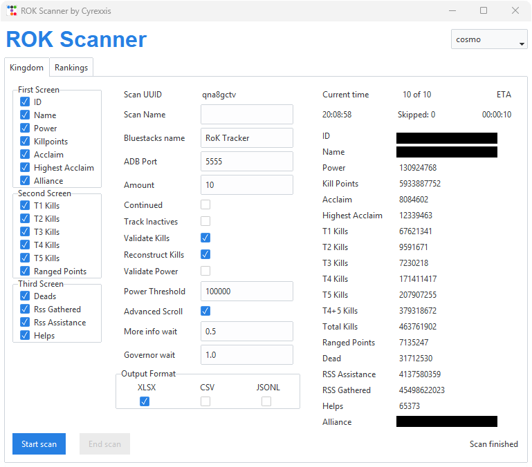
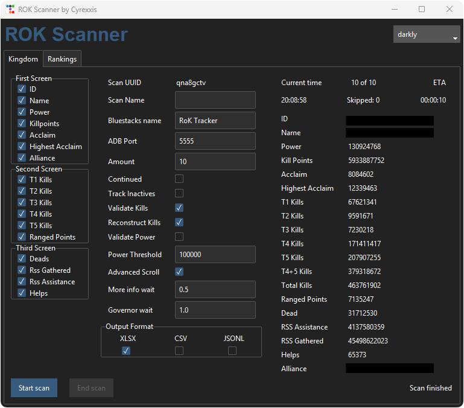

# Rok Tracker

## Summary

Open Source Rise of Kingdoms Stats Management Tool. Track TOP X players in kingdom / alliance / honor leaderboard. Depending on what you scan the resulting spreadsheet will look different:

**Kingdom rankings:** Governor ID, Governor Name, Power, Kill Points, Ranged Points, T1-T5 Kills, Total Kills, T4+T5 Kills, Dead Troops, RSS Gathered, RSS Assistance, Helps and Alliance name.

**Honor, alliance and seed rankings:** Governor name and score only. Because the game doesn't guarantee name accuracy, a screenshot of the name is saved in addition.

This is a heavily modified version of the original tool from [nikolakis1919](https://github.com/nikolakis1919/RokTracker).

There are two ways of using the scanner:
- **Simple installation** — download the released `.exe`, no Python required. [Instructions below](#simple-installation).
- **Advanced installation** — clone the source and run with Python. [Instructions below](#advanced-installation).

## Breaking Changes (v6)

- **Config restructured:** The single `config.json` has been replaced with a `config/` folder containing multiple files for global settings, scanner presets, and GUI config. Version 5 configs are not compatible.
- **Unified scanner:** The individual `kingdom_scanner`, `alliance_scanner`, `honor_scanner`, and `seed_scanner` entry points have been merged into a single `scanner_console.py` and `scanner_ui.py`. The CLI presents an interactive menu to select the scan type.

## Latest Changes

- Unified scanner
- More config options
  - Options per scan type
  - UI positions no longer hard coded → now in `config/internal/*.json`
- Support for Acclaim
- New GUI with theme support

---

## Screenshots

<details>

<summary>Click to expand</summary>

| Light Theme | Dark Theme |
|-------------|------------|
|  |  |

</details>

---

## Simple Installation

Download the latest [RoK Tracker.zip release](https://github.com/Cyrexxis/RokTracker/releases/latest). Extract it and:

1. Download [tessdata (trained data)](https://github.com/tesseract-ocr/tessdata) → place into `deps/tessdata/`
2. Download [ADB Platform Tools](https://dl.google.com/android/repository/platform-tools_r31.0.3-windows.zip) → place into `deps/platform-tools/`
3. Configure Bluestacks 5 (resolution 1600x900, DPI 450, ADB enabled) — [see below](#bluestacks-5-settings)
4. Adjust default options in the [config files](#config-files)
5. Double-click the `.exe` to run

---

## Advanced Installation

**Prerequisites:** Bluestacks 5, Python 3.14+ ([download](https://www.python.org/downloads/)) or uv ([instructions](https://docs.astral.sh/uv/)), [tessdata](https://github.com/tesseract-ocr/tessdata), [ADB Platform Tools](https://dl.google.com/android/repository/platform-tools_r31.0.3-windows.zip). On Windows, [Build Tools for C++](https://visualstudio.microsoft.com/de/visual-cpp-build-tools/) may be required. Here is how to set it up with uv:

1. Download the [source code release](https://github.com/Cyrexxis/RokTracker/releases/latest)
2. Place tessdata and platform-tools into the `deps/` folder (see [Folder Structure](#folder-structure))
3. Configure Bluestacks 5 — [see below](#bluestacks-5-settings)
4. Install dependencies: `uv sync`
5. Run the scanner:
   - `uv run scanner_console.py` — CLI (select scan type interactively)
   - `uv run scanner_ui.py` — GUI (tabs for Kingdom and Rankings)

---

## Config Files

The `config/` folder contains these files:

| File | Purpose |
|------|---------|
| `config.json` | Global settings (Bluestacks instance name, ADB port, log paths) |
| `kingdom_defaults.json` | Default options for kingdom scans |
| `seed_defaults.json` | Default options for seed (quick) scans |
| `alliance_defaults.json` | Default options for alliance ranking scans |
| `honor_defaults.json` | Default options for honor ranking scans |
| `gui_config.json` | GUI settings (default theme) |

---

## Folder Structure

Only two directories need manual attention:

```
deps/
├── tessdata/
└── platform-tools/
```

Everything else (`config/`, `_internal/`, source scripts) is either downloaded from the release or generated automatically. Scan results go into `scans_kingdom/`, `scans_alliance/`, `scans_honor/`, `scans_seed/`. Intermediate screenshots go into `temp_images/`.

---

## Features

### Kingdom Scanner

- Full kingdom ranking scan (all governors)
- Wrong kill detection: validates that kills match kill points; suspicious items are saved to `manual_review/` with `F` prefix and a warning is logged
- Kill reconstruction: option to try recovering wrong kill values; reconstructed items get `R` prefix in `manual_review/`
- Inactive account detection: accounts that can't be clicked are skipped automatically; screenshots can optionally be saved to `inactives/`
- Stats to scan can be selected (if only stats from 1st page are use 2nd and 3rd page will get skipped to make the scan faster)

### Ranking Scanner

- Full alliance ranking scan
- Full personal honor ranking scan
- Seed scan (from kingdom rankings)
- Names are approximate (game limitation); governor ID is not tracked

---

## Bluestacks 5 Settings

### Main Configuration

- **Display tab:** Resolution 1600x900, DPI Custom (450) ([screenshot](images/bluestacks-display.png))
- **Advanced tab:** Android Debug Bridge — Enabled ([screenshot](images/bluestacks-advanced.png))

### ADB Configuration

By default, the scanner assumes ADB port 5555. To configure automatic port detection:

1. Set `bluestacks_config` in `config/config.json` to your Bluestacks config file location (usually `C:\ProgramData\Bluestacks_nxt\bluestacks.conf`)
2. Make sure the instance name in `config.json` matches your Bluestacks instance name — the scanner asks for it interactively
3. The scanner auto-detects the ADB port from the config file. If no `bluestacks.conf` exists, your instance likely always uses port 5555

Not every Bluestacks variant has a config, that is not a limitation of the scanner but the installed android or Bluestacks versions. However, in those cases it is very likely that the port 5555 is used.

---

## Important Notes

### Scan Preparation

- Your active character must be in **Home Kingdom** to scan only your kingdom (otherwise KvK players from other kingdoms are included)
- Start the scanner from the **top** of the relevant ranking page — don't scroll during the scan
- **Kingdom scan only:** Your rank must be lower than the number of players you want to scan (e.g., can't scan top 100 if you're ranked 85). Use an alt account
- **Kingdom scan only:** "Resume scan" starts from the governor currently visible on screen (the 4th one down)
- Game Language must be **English** — other languages break inactive governor detection
- Chinese characters may not render in CMD but are visible in the final export file
- You can do other things on your PC while scanning, but avoid copying text since the scanner uses the clipboard to read names
- **Important:** Always copy the scan `.xlsx` file when finished — on the next scan there is a (small) chance it gets overwritten

### Configuration

- Always use `\\` or forward slashes `/` in the Bluestacks path fields in config files (raw `\` will cause a `JSONDecodeError`)

## Getting Help

The best way to get help is on Discord — my username is **cyrexxis** (same as my GitHub username). I'm on the official RoK Server and the Chisgule server.

To get help faster, follow these rules:
1. Send a message request explaining your problem
2. Include your `scanner.log` file — "it doesn't work" without logs won't get answered
3. There's no guaranteed response time since this is a free-time project

[GitHub Discussions](https://github.com/Cyrexxis/RokTracker/discussions) is another option — others may benefit from your troubleshooting
